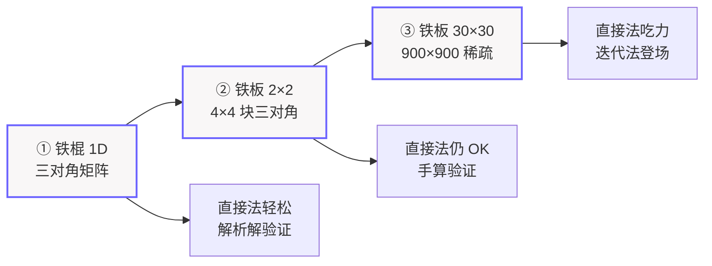

# 任务一设计：迭代法解线性方程组 —— 从铁棍到铁板的"升温"之旅

> 课程：数学思维实践（CST4822A）· 任务一 · 线性代数实验（满分 15）
> 版本：v0.3（2026-07-04 · 三级递进叙事版）　|　状态：**数学原理已讲透，待确认实现范围后定稿**

---

## 一、一句话目标

把「求一块铁板的稳态温度」翻译成线性方程组 $Ax=b$，沿着 **铁棍 → 2×2 铁板 → 30×30 铁板** 的路径一路升级，在网格变细、直接法开始喘气的时候，引出 **Jacobi** 和 **Gauss-Seidel** 两种迭代法，和直接解对比，画图，分析谁更快、为什么。

---

## 二、开场：一块铁板引发的"测温"问题

想象一块刚从炉膛里取出的方形铁板：上沿烧得通红（100°C），另外三条边却浸在冰水里（0°C）。你盯着它，脑子里冒出一个朴素的问题——**稳态之后，铁板正中央那一点，到底是多少度？**

热量从滚烫的上沿往下渗、被冰冷的左/右/下边不断抽走，整块板在拉锯中慢慢达成某种默契的平衡。要把板上每一点的稳态温度算出来，我们要做的，就是把这件"热平衡"的物理事，翻译成数学能咀嚼的语言：线性方程组 $Ax=b$。

但怎么算？这背后是一段有意思的递进——

---

## 三、三级递进总览（我们的"升温"路线图）



| 阶段 | 问题 | 矩阵 | 解法 | 这一级干什么 |
|---|---|---|---|---|
| **① 铁棍 1D** | 一根棒两端固定温度 | 三对角（小） | **直接法** | 建立「物理→离散→$Ax=b$→直接解」链条，用解析解验证可信 |
| **② 铁板 2×2** | 升级二维，最小例子 | 4×4 | **仍用直接法** | 证明五点差分推广到 2D 没错，手算出 $[37.5,37.5,12.5,12.5]$ |
| **③ 铁板 30×30** | 网格变细，求精细温度场 | 900×900 稀疏 | **迭代法**（Jacobi + GS） | 直接法扛不住 → 迭代法登场，两方法对比 + 谱半径 + 规模效应 |

**动机链一句话**：棍（小，直接法轻松）→ 板 2×2（直接法仍能解，验证 2D 建模对）→ 板 30×30（直接法开始喘气，迭代法登场）。

为什么要这样递进？因为「为什么用迭代法」这个问题，最好的答案不是规定，而是**让直接法自己在网格变细时露出疲态**——届时迭代法的登场就顺理成章了。

---

## 四、第一幕：铁棍（1D）—— 用直接法建立信任

### 4.1 问题

先不碰铁板，从它的一维表亲「铁棍」说起。一根金属棒，**左端烧到 100°C，右端泡在 0°C**，求棍上 5 个内部点的稳态温度。

```
   左 100°C                         右 0°C
    ●━━━━━┯━━━━━┯━━━━━┯━━━━━┯━━━━━┯━━━━━●
          T1    T2    T3    T4    T5
```

### 4.2 建模：从"邻居平均"到三对角矩阵

稳态下，棒上每个点的温度 = 左右两邻居的平均（一维版的"热平衡"，道理同铁板，只是邻居只有两个）。写成方程：

$$-T_{i-1}+2T_i-T_{i+1}=0$$

5 个内部点的方程排起来，得到一个**三对角矩阵（像一条窄窄的十字花边，只有主对角线和紧贴它的两条斜线上有数字，其余位置全空）**：

$$\begin{bmatrix} 2&-1&0&0&0\\-1&2&-1&0&0\\0&-1&2&-1&0\\0&0&-1&2&-1\\0&0&0&-1&2\end{bmatrix}\begin{bmatrix}T_1\\T_2\\T_3\\T_4\\T_5\end{bmatrix}=\begin{bmatrix}100\\0\\0\\0\\0\end{bmatrix}$$

### 4.3 直接解 vs 解析解：双重验证

矩阵小（5×5），直接法（高斯消元）轻松拿下，解是：

$$[83.33,\ 66.67,\ 50,\ 33.33,\ 16.67]$$

正好是 100 到 0 的**等距下降**。而这个问题其实有**解析解（不靠电脑硬算，直接用数学公式精确求出的标准答案）**：温度沿棍是一条直线 $T(x)=100(1-x/L)$。把 5 个点代进去，和直接解**完全重合**。

> **这一幕的收获**：解析解像一把标尺，盖在直接解上一纹不差——我们建立的「物理→离散→$Ax=b$→直接解」这套方法是可信的。带着这份信任，才敢升级到二维。

---

## 五、第二幕：铁板 2×2 —— 五点差分与直接法验证

### 5.1 升级到二维：邻居从 2 个变 4 个

铁板是二维的，每个内部点的"邻居"从左右两个，变成**上下左右四个**。稳态的规矩也随之升级：每点温度 = 四邻居的平均。这就是**五点差分（每个点的温度由上下左右四个邻居"投票"取平均决定）**。

### 5.2 「4T − 四邻居 = 0」怎么来的

**第一步：稳态 = 每点正好是邻居的平均。** 若某点比邻居平均偏高，它就比周围热，热量往外跑、自己降温，直到等于平均才停；偏低则反向升温。所以稳态的必然结果：每点 = 四邻居平均。

**第二步：「4」怎么来——水平一份、竖直一份。** 温度沿水平和竖直两个方向都得平缓变化（都像直线）：
- 水平：中间点 = 左右平均 → $2T=T_{\text{左}}+T_{\text{右}}$
- 竖直：中间点 = 上下平均 → $2T=T_{\text{上}}+T_{\text{下}}$

两式相加：$\underbrace{2T+2T}_{=\,4T}=T_{\text{左}}+T_{\text{右}}+T_{\text{上}}+T_{\text{下}}$。所以系数是 **4**（一维只有 2，二维翻倍）。铁棍是 $2T$、铁板是 $4T$，一脉相承。

**第三步：「减号」怎么来——纯移项变号。** 把右边的邻居全移到左边（正变负），整理成排矩阵要用的标准形式：

$$\boxed{\;4T-T_{\text{左}}-T_{\text{右}}-T_{\text{上}}-T_{\text{下}}=0\;}$$

减号没有物理含义，纯粹是代数移项。

### 5.3 组装 $Ax=b$：最小的 2×2 例子手算

内部只有 $2\times2=4$ 个点，标号 $T_1,T_2,T_3,T_4$：

```
      上边 100°C
   ┌───────────┐
   │  T1   T2  │   ← 上排（紧贴上边）
   │  T3   T4  │   ← 下排（紧贴下边）
   └───────────┘
      下边 0°C      左右边都 0°C
```

逐点套公式（邻居若是边界，移到右边变成 $b$）：

- $T_1$（左上，上邻居=100）：$4T_1-T_2-T_3=100$
- $T_2$（右上，上邻居=100）：$4T_2-T_1-T_4=100$
- $T_3$（左下）：$4T_3-T_1-T_4=0$
- $T_4$（右下）：$4T_4-T_2-T_3=0$

排成矩阵：

$$\underbrace{\begin{bmatrix}4&-1&-1&0\\-1&4&0&-1\\-1&0&4&-1\\0&-1&-1&4\end{bmatrix}}_{A}\underbrace{\begin{bmatrix}T_1\\T_2\\T_3\\T_4\end{bmatrix}}_{x}=\underbrace{\begin{bmatrix}100\\100\\0\\0\end{bmatrix}}_{b}$$

### 5.4 直接解验证

4×4 矩阵，直接法秒解：$T_1=T_2=37.5,\;T_3=T_4=12.5$。
验证 $T_1$：$4\times37.5-37.5-12.5=150-50=100$ ✓

含义很直觉：上排点紧挨 100°C 热边 → 37.5°C；下排点紧挨 0°C 冷边 → 12.5°C。

> **这一幕的收获**：直接解符合物理直觉，证明我们把铁棍那套方法**推广到二维**（$2T\to4T$、三对角→块三对角）是正确的。地基打牢，可以往上盖楼了。

---

## 六、第三幕：铁板 30×30 —— 当直接法开始喘气，迭代法登场

### 6.1 网格变细：从 4 个点到 900 个点

把网格从 $2\times2$ 加密到 $30\times30$，内部点从 4 个变成 **900 个**，矩阵 $A$ 膨胀成 **900×900**。它仍是个**稀疏矩阵（一座空荡荡的大厅里稀稀拉拉坐了几个人——个头虽大，绝大多数位置是 0；900×900≈81 万个位置里，只有约 4500 个非零）**，结构是**块三对角（把大矩阵切成小方块拼起来，只有主对角块和紧邻它的两条块带上有内容）**。

### 6.2 直接法的疲态

直接法（高斯消元）当然还能解，但它有个致命习惯：**消元过程会把稀疏矩阵"填满"**。原本只存 4500 个数就够的矩阵，消元时中间步骤会冒出海量非零数，81 万个位置都得存、都得算。900×900 还能扛，要是 $100\times100$（1 万×1 万）呢？直接法直接趴窝。

> **转机来了**：我们不需要"一步算准"，只需要"一步步逼近"——这正是迭代法的舞台。

### 6.3 迭代法：先猜，再反复修正

思路朴素得像猜数游戏：先随便猜一组温度（比如全填 0），用"邻居平均"公式刷新每个点，把新值当答案再刷一遍……反复重复，直到温度几乎不再变化。这就是稳态解。

两种方法的**唯一区别**，在于「算新一轮时，邻居用旧值还是新值」：

**Jacobi 迭代（算新一轮时，所有邻居都用上一轮的"旧消息"，谁也不许抢跑）**：

$$T^{(\text{新})}=\tfrac{1}{4}(T_{\text{左}}^{(\text{旧})}+T_{\text{右}}^{(\text{旧})}+T_{\text{上}}^{(\text{旧})}+T_{\text{下}}^{(\text{旧})})$$

**Gauss-Seidel 迭代（按顺序逐点更新，算过的邻居立刻换上"新鲜出炉"的新值，消息传得飞快）**：

$$T^{(\text{新})}=\tfrac{1}{4}(\underbrace{T_{\text{左}}^{(\text{新})}}_{\text{已算}}+\underbrace{T_{\text{下}}^{(\text{新})}}_{\text{已算}}+\underbrace{T_{\text{右}}^{(\text{旧})}}_{\text{未算}}+\underbrace{T_{\text{上}}^{(\text{旧})}}_{\text{未算}})$$

### 6.4 数值演示：回到 2×2 例子看个清楚

用第五幕那个 2×2 例子（真值 $[37.5,37.5,12.5,12.5]$），初值全 0：

**Jacobi（全用旧值，慢）**：

| 轮次 | $T_1$ | $T_2$ | $T_3$ | $T_4$ |
|---|---|---|---|---|
| 初值 | 0 | 0 | 0 | 0 |
| 第 1 轮 | 25.00 | 25.00 | 0.00 | 0.00 |
| 第 2 轮 | 31.25 | 31.25 | 6.25 | 6.25 |
| 第 3 轮 | 34.38 | 34.38 | 9.38 | 9.38 |
| 第 6 轮 | 37.11 | 37.11 | 12.11 | 12.11 |
| **真值** | **37.5** | **37.5** | **12.5** | **12.5** |

**Gauss-Seidel（算过的用新值，快）**：

| 轮次 | $T_1$ | $T_2$ | $T_3$ | $T_4$ |
|---|---|---|---|---|
| 初值 | 0 | 0 | 0 | 0 |
| 第 1 轮 | 25.00 | 31.25 | 6.25 | 9.38 |
| 第 2 轮 | 34.38 | 35.94 | 10.94 | 11.72 |
| 第 3 轮 | 36.72 | 37.11 | 12.11 | 12.30 |
| **真值** | **37.5** | **37.5** | **12.5** | **12.5** |

对比：Jacobi 要到第 6 轮 $T_1$ 才到 37.11，GS 第 3 轮就到了 36.72——**GS 快约 2 倍**。

### 6.5 谱半径：衡量"快慢"的标尺

为什么 GS 比 Jacobi 快 2 倍？答案藏在一个叫**谱半径 $\rho$（每迭代一轮，误差就被它乘一下当"折扣"——$\rho$ 越小误差缩水越快，必须 $\rho<1$ 才收敛）**的数里。对 $n\times n$ 网格：

$$\rho_{\text{Jacobi}}=\cos\frac{\pi}{n+1},\qquad \rho_{\text{GS}}=\rho_{\text{Jacobi}}^{2}$$

GS 的谱半径是 Jacobi 的**平方**（更小），所以快约 2 倍——和上面数值演示严丝合缝。

**规模效应（结果分析的重点）**：网格越密（$n$ 越大），$\rho$ 越贴近 1，收敛越慢：

| 每边点数 $n$ | 矩阵规模 | $\rho_{\text{Jacobi}}$ | $\rho_{\text{GS}}$ | 大致迭代轮数 |
|---|---|---|---|---|
| 10 | 100×100 | 0.9595 | 0.9206 | 几十~上百 |
| 30 | 900×900 | 0.9949 | 0.9898 | 上千 |
| 50 | 2500×2500 | 0.9981 | 0.9962 | 几千 |

网格加密，迭代次数猛增——这是迭代法的痛点，也是后续可以改进（如 SOR 加速法）的方向。

### 6.6 不收敛反例：矩阵性质才是幕后大哥

迭代法一定收敛吗？未必。关键是矩阵要**对角占优（每行的"主角"对角线够硬气，单挑得过同行其他数之和）**——我们的热传导矩阵恰好满足，所以收敛。

**反例（建议加，结果分析加分）**：造一个**不对角占优**的矩阵，比如 $A=\begin{bmatrix}1&2\\2&1\end{bmatrix}$，它的 Jacobi 谱半径 $>1$，迭代会**发散**（越算越乱）。一张发散的误差曲线，直接证明「**矩阵性质决定迭代效果**」——这正是评分点的关键。

### 6.7 直接法当裁判，迭代法当选手

最后别忘了任务书要求的"与直接解对比"：用直接法（`numpy.linalg.solve`）算出**标准答案**当裁判，迭代法当选手去逼近它，对比误差和速度。你那句"迭代法是猜测逼近，不是直接算"——正是这场对比的灵魂。

---

## 七、计算实现层（评分：算法实现 4 分）

### 7.1 代码结构（低技术债 · 单文件函数化）

```
mission1/
├── heat.py          # 1D 铁棍 + 2D 铁板：建模/Jacobi/GS/直接解/画图，约 300 行
├── README.md        # 怎么运行
└── output/*.png     # 生成的图
```

### 7.2 函数划分（每个职责单一）

- `build_1d(n, T_left, T_right) → (A, b)`：铁棍三对角系统
- `build_2d(n, 边界温度) → (A, b)`：铁板块三对角系统
- `jacobi(A, b, x0, tol, max_iter) → (x, err_history)`
- `gauss_seidel(...) → (x, err_history)`
- `solve_direct(A, b) → x`：直接法当"裁判"
- 画图：`plot_rod / plot_matrix / plot_heatmap / plot_error_curve / plot_compare`

### 7.3 参数

| 项 | 取值 |
|---|---|
| 网格 | 铁棍 $n=5$；铁板 $n=2$（验证）+ $n=30$（主实验） |
| 初值 | 全 0 |
| 停止条件 | $\lVert x_{\text{新}}-x_{\text{旧}}\rVert<10^{-6}$ 或达 10000 轮 |
| 直接解 | `numpy.linalg.solve(A, b)` |
| 记录 | 每轮误差、残差、耗时 |

只依赖 `numpy` + `matplotlib`（`scipy.sparse` 可选，高效存稀疏矩阵）。

---

## 八、可视化验证层（评分：可视化 3 分）

每张图都有编号、标题、文字解释（任务书明确"不能只贴图不分析"）。沿三级递进各配图：

| 阶段 | 图 | 展示什么 / 支持什么结论 |
|---|---|---|
| 铁棍 | 温度折线（直接解 vs 解析直线） | 两线重合 → 方法可信 |
| 铁板 2×2 | 4×4 矩阵结构图 `plt.spy(A)` + 4 点温度 | 矩阵稀疏、解符合直觉 |
| 铁板 30×30 | **温度场热力图**（迭代解 vs 直接解并排）+ 误差半对数曲线（Jacobi vs GS）+ 方法对比条形图（轮数/误差/耗时） | 热力图肉眼一致 → 误差达标；GS 曲线更陡 → 更快，与 $\rho_{GS}=\rho_J^2$ 吻合 |

> 温度场热力图是 2D 相对 1D 最大的视觉升级：一张图就能看到热量从顶部 100°C 向下扩散、被左右冷边拉到 0 的完整画面。

---

## 九、结果分析层（评分：结果分析 4 分）

报告里讲清四点（对应评分点"收敛性、误差、方法差异、原因"）：

1. **收敛性**：两方法都收敛（$\rho<1$，由对角占优保证）。
2. **收敛速度**：GS 比 Jacobi 快约 2 倍，对应 $\rho_{GS}=\rho_J^2$。
3. **误差**：迭代解与直接解之差 $<10^{-6}$，达标。
4. **矩阵性质的影响**（满分关键）：对角占优保证收敛；网格 $n$ 增大 → $\rho\to1$ → 迭代变慢；不对角占优则发散（反例）。

---

## 十、对应评分细则自查（15 分）

| 评分点 | 分值 | 本设计如何拿 |
|---|---|---|
| 模型建立 | 3 | 铁棍→铁板递进，$Ax=b$ 与 A/x/b 含义层层讲清（第四、五幕） |
| 算法实现 | 4 | 直接法 + Jacobi + GS 三实现，参数合理，可运行（第七节） |
| 可视化表达 | 3 | 折线 / 矩阵结构 / 热力图 / 误差曲线，每图配解释（第八节） |
| 结果分析 | 4 | 收敛、速度、误差、矩阵性质 + 不收敛反例（第六、九节） |
| 规范性 | 1 | 函数化代码、图表编号、README |

---

## 十一、待你拍板的开放问题 ⚠️

1. **铁棍 1D 的篇幅**：作为引入简述（推荐）/ 完整建模 + 独立图表？
2. **网格规模**：铁板 $n=30$（推荐）/ 更大或更小？
3. **方法范围**：Jacobi + GS（推荐）/ 再加 SOR 加速法？
4. **不收敛反例**：加（推荐，结果分析加分）/ 不加？
5. **本轮交付**：先确认这份设计 / 直接开写代码？

> 你逐条回（或直接说"按推荐的来"）即可，我据此定稿并进入实现计划。

---

> **尾声**：从一根两端冷热的铁棍，到一块四条边较劲的铁板，再到网格密如棋盘的精细温度场——我们看着直接法在小矩阵上轻盈起舞，又在 900×900 面前露出疲态，最后迎来迭代法"以勤补拙、反复逼近"的登场。这趟"升温"之旅要讲的，从来不只是怎么解一个方程组，而是**面对越来越大的问题，数学方法如何一步步让步、演进**。
