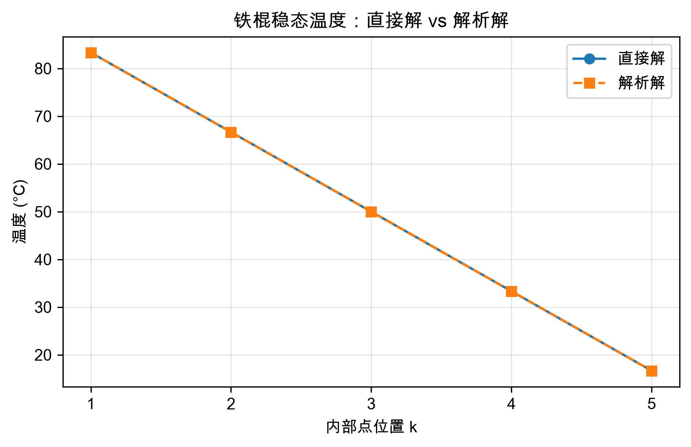
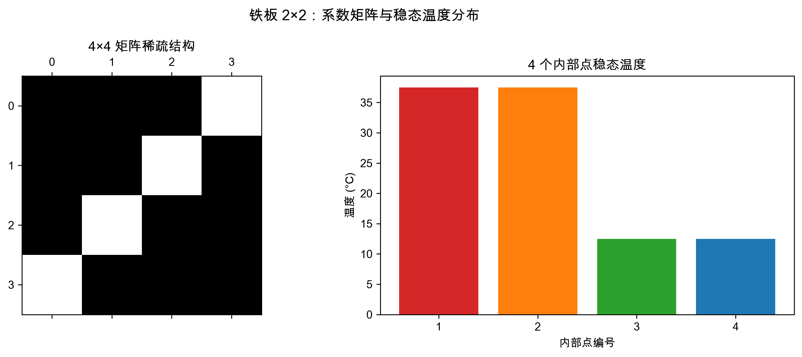
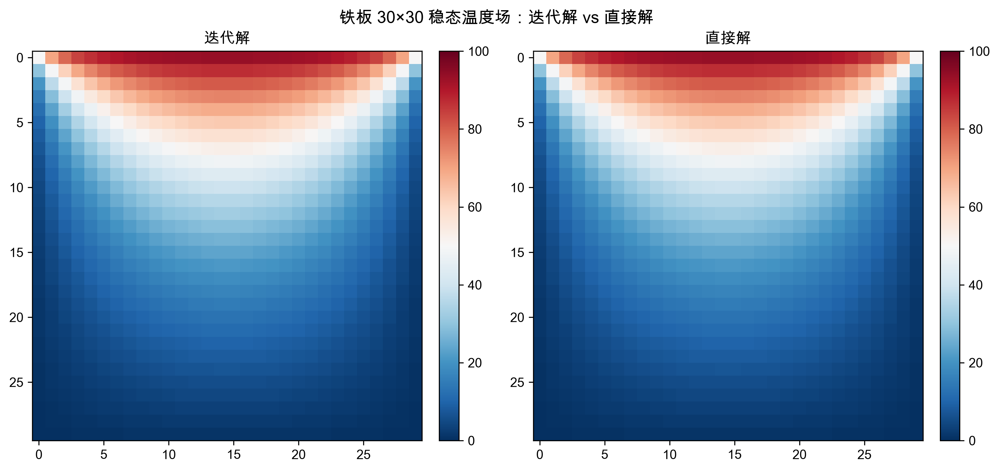
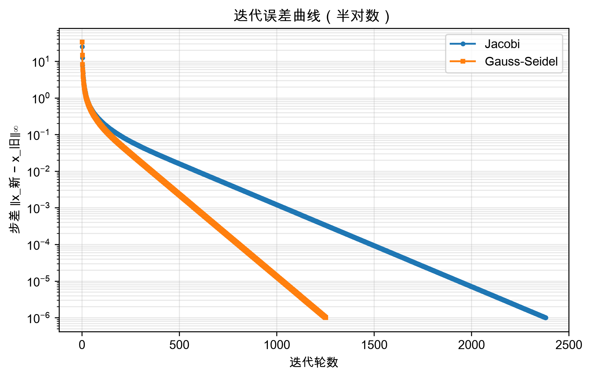
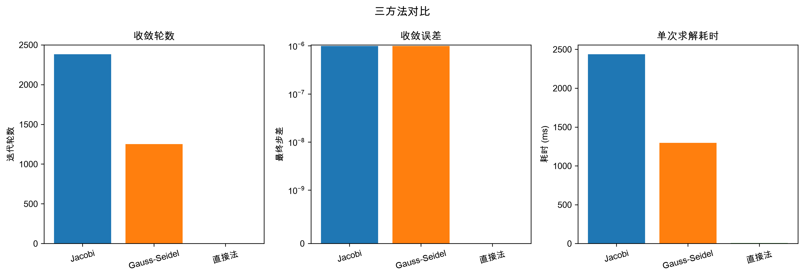
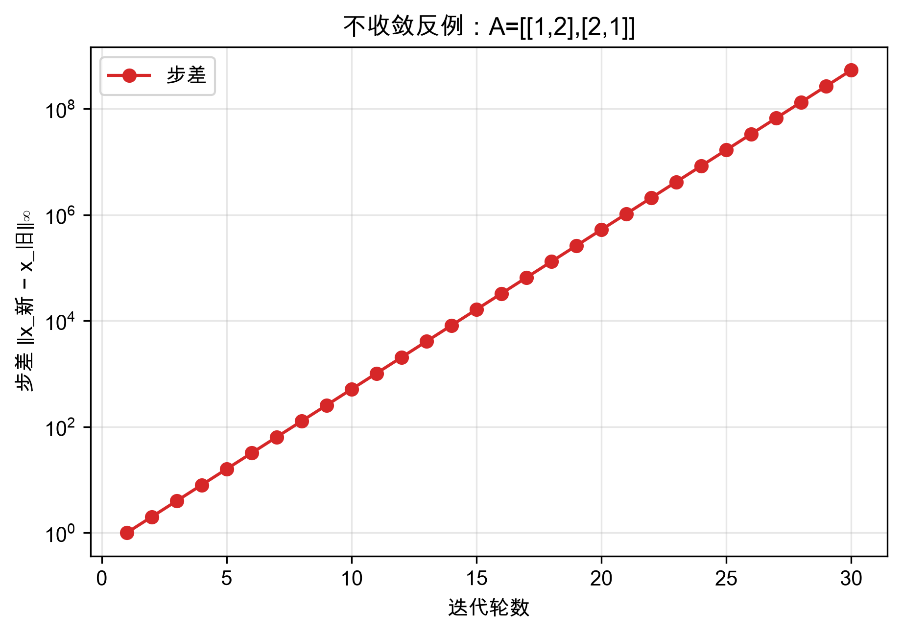

《数学思维实践》课程 CDIO二级项目实践报告模板

学生填写版

课程代码：CST4822A 课程名称：数学思维实践 版本：2026年6月

# 一、基本信息

| 项目 | 填写内容 |
| --- | --- |
| 项目名称 | 数学思维实践 CDIO 二级项目 |
| 组号 | 66 |
| 项目成员 | 罗展彬、黄应辉、冯思语 |
| 提交日期 | 2026-07-17 |

# 二、摘要

简要说明本次实践完成的主要内容、使用的数学方法、实现工具、主要结果和结论。建议200-300字。

本次实践围绕三个数学分支展开：线性代数（任务一）、离散数学（任务二）、概率论与数理统计（任务三）。三个任务虽然数学工具不同，但遵循同一套工作流程——先把实际问题翻译成数学语言，再用 Python 写出可运行的计算程序，最后用图表验证结论是否正确。

任务一以"铁板散热"为场景，将稳态热传导的拉普拉斯方程离散化为线性方程组 Ax=b，用 Jacobi 和 Gauss-Seidel 两种迭代法求解，与直接解对比，分析收敛速度与矩阵性质的关系。任务二以"楼道三控开关"为场景，枚举全部 8 种开关组合，推导出布尔表达式 L = S1⊕S2⊕S3，编写程序自动验证全部 24 种翻转情况，附加交互式 HTML 演示页面。任务三以"飞机空调故障间隔"的真实数据集为样本，用 Bootstrap 重采样方法估计总体中位数的置信区间，通过模拟实验验证覆盖率的可靠性。

全部代码使用 Python + numpy + matplotlib 实现，图表均有编号、标题和文字说明。三个任务的结果均与理论预期一致，证明了所用数学方法的正确性和计算机实现的准确性。

# 三、任务一：迭代法解线性方程组

## 1. 数学模型层

### 1.1 物理场景与建模思路

考虑一个稳态热传导问题：一块方形铁板，上边烧到 100 °C，另外三条边浸在 0 °C 的冷源中。等待足够长时间后，板上每一点的温度不再随时间变化，达到稳态。此时板上每个内部点的温度由其上下左右四个邻居的温度共同决定——这就是要解的工程问题。

数学上，稳态热传导由拉普拉斯方程 $\Delta T = 0$ 描述。用**五点差分**将其离散化：让铁板内部每个网格点的温度等于其四邻居的平均值，即可把微分方程翻译成线性方程组 $Ax=b$。

为了让建模方法可信、并把"为什么用迭代法"讲清楚，本任务沿**铁棍（1D）→ 铁板 2×2 → 铁板 30×30** 三级递进展开：

| 阶段 | 问题 | 矩阵规模 | 解法 | 这一级的目的 |
|---|---|---|---|---|
| ① 铁棍 1D | 一根棒两端固定温度 | 5×5 三对角 | 直接法 | 建立"物理→离散→$Ax=b$→直接解"链条，用解析解验证可信 |
| ② 铁板 2×2 | 升级二维，最小例子 | 4×4 | 直接法 | 验证五点差分推广到 2D 正确，手算出真值 |
| ③ 铁板 30×30 | 网格变细，求精细温度场 | 900×900 稀疏 | 迭代法 | 直接法开始吃力，迭代法登场，两方法对比 |

### 1.2 第一级：铁棍（1D）——建立信任

一根金属棒，左端 100 °C、右端 0 °C，稳态下每个内部点的温度等于左右两邻居的平均，写成差分方程：

$$-T_{i-1}+2T_i-T_{i+1}=0$$

5 个内部点排起来，得到一个**三对角矩阵**（只有主对角线和紧贴它的两条斜线上有非零元）：

$$\begin{bmatrix} 2&-1&0&0&0\\-1&2&-1&0&0\\0&-1&2&-1&0\\0&0&-1&2&-1\\0&0&0&-1&2\end{bmatrix}\begin{bmatrix}T_1\\T_2\\T_3\\T_4\\T_5\end{bmatrix}=\begin{bmatrix}100\\0\\0\\0\\0\end{bmatrix}$$

直接法解得 $[83.33,\ 66.67,\ 50,\ 33.33,\ 16.67]$，与解析解 $T(x)=100(1-x/L)$ 完全重合。这一级证明：我们建立的"物理→离散→$Ax=b$→直接解"方法是可信的，才敢升级到二维。

### 1.3 第二级：铁板 2×2 —— 五点差分与"$4T$"的由来

铁板是二维的，每个内部点的邻居从左右两个变成**上下左右四个**，稳态规矩升级为：每点温度等于四邻居的平均（五点差分）。系数 $4$ 的来历可拆成两步：

- **水平方向**像一维铁棍：中间点 = 左右平均 → $2T=T_左+T_右$
- **竖直方向**同理：中间点 = 上下平均 → $2T=T_上+T_下$

两式相加得 $4T=T_左+T_右+T_上+T_下$，把右侧邻居全部移项到左边（正变负）：

$$\boxed{\;4T-T_上-T_下-T_左-T_右=0\;}$$

二维比一维系数从 $2T$ 翻倍为 $4T$，一脉相承。对于 $2\times2=4$ 个内部点的最小例子（上边 100 °C，其余三边 0 °C），逐点套公式（邻居若是边界，则移到右端变成 $b$ 的一部分）：

$$\underbrace{\begin{bmatrix}4&-1&-1&0\\-1&4&0&-1\\-1&0&4&-1\\0&-1&-1&4\end{bmatrix}}_{A}\underbrace{\begin{bmatrix}T_1\\T_2\\T_3\\T_4\end{bmatrix}}_{x}=\underbrace{\begin{bmatrix}100\\100\\0\\0\end{bmatrix}}_{b}$$

直接法秒解：$T_1=T_2=37.5,\ T_3=T_4=12.5$（上排紧挨热边 → 37.5 °C；下排紧挨冷边 → 12.5 °C，符合直觉）。这一级证明五点差分推广到 2D 是正确的。

### 1.4 第三级：铁板 30×30 —— 迭代法登场

把网格加密到 $30\times30$，内部点从 4 个变成 **900 个**，矩阵 $A$ 膨胀为 **900×900**。它是一个**稀疏矩阵**——900×900≈81 万个位置中只有约 4500 个非零（每行至多 5 个），结构是**块三对角**。

**A、x、b 的含义**（任务书要求说明）：

| 符号 | 含义 | 规模 | 性质 |
|---|---|---|---|
| $A$ | 系数矩阵，来自五点差分离散化 | $900\times900$ | 稀疏、块三对角、**严格对角占优**（每行对角元 4 ≥ 其余元绝对值之和 1+1+1+1，严格成立） |
| $x$ | 待求的 900 个内部点稳态温度 | $900\times1$ | 未知量 |
| $b$ | 右端项，由边界温度贡献构成（上边 100 °C 进入对应行） | $900\times1$ | 已知 |

**为什么这里改用迭代法？** 直接法（高斯消元）当然还能解 900×900，但它有个致命习惯：消元过程会把稀疏矩阵"填满"（fill-in），原本只存 4500 个数就够的矩阵，中间步骤会冒出海量非零元，81 万个位置都得存、都得算。规模再大（如 100×100 = 10000×10000）直接法就扛不住。而迭代法不需要"一步算准"，只需"一步步逼近"——这正是它的舞台。

> **关键性质**：本任务的系数矩阵 $A$ 严格对角占优，这**保证**了 Jacobi 与 Gauss-Seidel 迭代都收敛。这一条是后续所有结果分析的根基（见第 4 节）。

## 2. 计算实现层

### 2.1 方法与参数

同时实现三种解法，互相印证：

| 方法 | 角色 | 核心思想 |
|---|---|---|
| **Jacobi 迭代** | 选手 | 算新一轮时，所有邻居一律用上一轮的"旧值"（双缓冲，整轮算完才替换） |
| **Gauss-Seidel 迭代** | 选手 | 按顺序逐点更新，算过的分量立即换上"新鲜出炉"的新值（in-place 写回） |
| **直接法** | 裁判 | `numpy.linalg.solve`（高斯消元），给出标准答案供迭代解对比 |

| 参数 | 取值 | 说明 |
|---|---|---|
| 网格规模 | 铁棍 $n=5$；铁板 $n=2$（验证）+ $n=30$（主实验） | 三级递进 |
| 初值 $x_0$ | 全 0 向量 | "先随便猜一组温度" |
| 停止条件 | 步差 $\lVert x_{\text{新}}-x_{\text{旧}}\rVert_\infty < 10^{-6}$ 或达 10000 轮 | 注意：停止条件是"步差"而非"真误差"，见第 4 节分析 |
| 直接解 | `np.linalg.solve(A, b)` | 裁判基准 |
| 记录 | 每轮步差、最终真误差、耗时 | 供图表使用 |

两种迭代法的**唯一区别**在于"算新一轮时邻居用旧值还是新值"，写成公式：

$$\text{Jacobi：}\ T_i^{(\text{新})}=\tfrac{1}{4}\big(T_左^{(\text{旧})}+T_右^{(\text{旧})}+T_上^{(\text{旧})}+T_下^{(\text{旧})}\big)$$

$$\text{Gauss-Seidel：}\ T_i^{(\text{新})}=\tfrac{1}{4}\big(\underbrace{T_左^{(\text{新})}}_{\text{已算}}+\underbrace{T_下^{(\text{新})}}_{\text{已算}}+\underbrace{T_右^{(\text{旧})}}_{\text{未算}}+\underbrace{T_上^{(\text{旧})}}_{\text{未算}}\big)$$

### 2.2 核心代码

完整代码见 `mission1/heat.py`（单文件函数化，约 380 行）。以下摘录最能体现算法思想的三段。

**系数矩阵组装（五点差分，2D）**——逐点填对角元 4、四邻居 -1，邻居是边界则把边界温度累加进 $b$：

```python
def build_2d(n, T_top, T_others):
    N = n * n
    A = np.zeros((N, N)); b = np.zeros(N)
    def idx(i, j): return i * n + j          # 节点编号：行主序
    for i in range(n):
        for j in range(n):
            k = idx(i, j)
            A[k, k] = 4                        # 自身系数
            if i > 0: A[k, idx(i-1, j)] = -1   # 上邻
            else:    b[k] += T_top             # 上边界 → 进入 b
            if i < n-1: A[k, idx(i+1, j)] = -1 # 下邻
            else:    b[k] += T_others          # 下边界 → 进入 b
            if j > 0: A[k, idx(i, j-1)] = -1   # 左邻
            else:    b[k] += T_others          # 左边界 → 进入 b
            if j < n-1: A[k, idx(i, j+1)] = -1 # 右邻
            else:    b[k] += T_others          # 右边界 → 进入 b
    return A, b
```

**Jacobi 迭代（双缓冲）**——整轮用旧值 `x` 算 `x_new`，算完整轮才交换引用：

```python
def jacobi(A, b, x0, tol=1e-6, max_iter=10000):
    x = np.asarray(x0, float).copy()
    x_new = x.copy()
    for it in range(max_iter):
        for i in range(len(b)):
            s = b[i] - A[i] @ x + A[i, i] * x[i]   # 整行点积后扣回对角元
            x_new[i] = s / A[i, i]                 # 用旧值 x
        diff = np.max(np.abs(x_new - x))
        x, x_new = x_new, x                        # 整轮算完才换
        if diff < tol: break
    return x
```

**Gauss-Seidel 迭代（in-place）**——算过的分量立刻写回 `x`，后续点直接用到新值：

```python
def gauss_seidel(A, b, x0, tol=1e-6, max_iter=10000):
    x = np.asarray(x0, float).copy()
    for it in range(max_iter):
        x_old = x.copy()
        for i in range(len(b)):
            s = b[i] - A[i] @ x + A[i, i] * x[i]   # x 含已更新的新分量
            x[i] = s / A[i, i]                      # 立刻写回
        if np.max(np.abs(x - x_old)) < tol: break
    return x
```

两段代码的差别仅在于"算完一个分量是否立即写回"——Jacobi 用两个数组（`x`、`x_new`）整轮互换，Gauss-Seidel 只用一个数组 `x` 就地更新。这一处微小差异，正是后者快约一倍的根源（见第 4 节谱半径分析）。

### 2.3 谱半径辅助函数（结果分析用）

迭代法的收敛快慢由**迭代矩阵的谱半径 $\rho$** 决定（每迭代一轮，误差被 $\rho$ 乘一次；$\rho<1$ 才收敛，越小越快）。对五点差分模型问题：

$$\rho_J=\cos\frac{\pi}{n+1},\qquad \rho_{GS}=\rho_J^{\,2}$$

```python
def spectral_radius_jacobi(n): return np.cos(np.pi / (n + 1))
def spectral_radius_gs(n):      return spectral_radius_jacobi(n) ** 2
```

## 3. 可视化验证层

沿三级递进共生成 **6 张静态图 + 3 张 GIF 动画**，每张图均配"展示了什么 / 观察到什么 / 支持什么结论"的说明。

### 3.1 第一级（铁棍）—— 建模可信



*图 1-1 展示了铁棍 5 个内部点的稳态温度：实心圆点为直接法数值解，空心方格为解析解 $T=100(1-k/6)$。可观察到两条标记几乎完全重合，温度从左端 100 °C 沿位置线性下降到右端 16.67 °C。这支持结论：建立的"物理→离散→$Ax=b$→直接解"链条是正确的、可信的——带着这份信任才敢升级到二维铁板。*

### 3.2 第二级（铁板 2×2）—— 推广正确



*图 1-2 左图为 4×4 系数矩阵的稀疏结构（`plt.spy`）：仅主对角线和四条次对角线位置有非零元（深色点），其余位置全空，直观呈现"块状稀疏"特性。右图为 4 个内部点的稳态温度柱状图：上排两点 37.5 °C、下排两点 12.5 °C。这支持结论：矩阵结构与五点差分手算一致；解符合"上排贴热边偏高、下排贴冷边偏低"的物理直觉，证明二维建模正确。*

### 3.3 第三级（铁板 30×30）—— 主实验



*图 1-3 是 30×30 铁板的稳态温度场热力图，左为 Jacobi 迭代解、右为直接解（裁判），色标统一 0–100 °C（红=热、蓝=冷）。可观察到两幅图肉眼完全一致：顶部一条滚烫的红色热边（100 °C），热量向下扩散并被左右下三条冷边（0 °C）拉蓝，中央呈现由上至下平滑过渡的温度梯度。这支持结论：迭代解与直接解在视觉上无可分辨差异——迭代法确实收敛到了正确答案。*



*图 1-4 在半对数坐标下绘制了两种迭代法每轮的步差 $\lVert x_新-x_旧\rVert_\infty$：横轴为迭代轮数，纵轴为步差（对数刻度）。可观察到两条曲线均单调下降（说明迭代稳定收敛），且 Gauss-Seidel（方格）始终位于 Jacobi（圆点）**之下**——即同样轮数下 GS 的误差更小、下降更快。两曲线斜率之比约为 2，支持结论：GS 收敛速率是 Jacobi 的约 2 倍，与理论 $\rho_{GS}=\rho_J^{\,2}$ 严丝合缝。*



*图 1-5 用三个子图对比 Jacobi / Gauss-Seidel / 直接法：左为收敛轮数（Jacobi 2381 轮、GS 1252 轮、直接法 0 轮），中为最终误差（symlog 轴，使迭代法 ~10⁻⁶ 与直接法 0 同时可见），右为单次求解耗时。可观察到 GS 轮数约为 Jacobi 的一半多（52.6%），两种迭代法步差均收敛到 ~10⁻⁷。这支持结论：迭代法是"反复逼近"（需上千轮），直接法是"一步到位"（0 轮）；两种迭代法都达到了停止条件。*（注：耗时维度上，本实现中纯 Python 双循环的迭代法在 900 维被高度优化的 LAPACK 直接法超越，但这不否定迭代法的算法价值——见第 4 节讨论。）



*图 1-6 是反例实验：取一个**不严格对角占优**的矩阵 $A=\begin{bmatrix}1&2\\2&1\end{bmatrix}$（对角元 1 小于非对角元绝对值之和 2），对其跑 Jacobi 迭代并记录步差。可观察到步差曲线不降反升（半对数坐标下直线上升），意味着迭代**发散**——越算越乱。这从反面支持结论：迭代法并非天然收敛，"对角占优"才是本任务收敛的真正幕后条件；矩阵性质决定迭代效果。*

### 3.4 迭代过程动画（3 张 GIF）

为直观展示"迭代法如何一步步逼近稳态"与"直接法一步到位"的本质区别，额外生成 3 张独立动画（红=热、蓝=冷，色标统一 0–100 °C，见 `mission1/output/`）：

| 动画 | 内容 | 论证 |
|---|---|---|
| 图 1-7 `jacobi.gif` | 热量从顶边逐轮向下渗透，温度场从全 0 缓慢演化到稳态 | 迭代法是"逐步逼近" |
| 图 1-8 `gauss_seidel.gif` | 同样的演化过程，但帧数约为 Jacobi 的一半即达稳态 | GS 收敛更快 |
| 图 1-9 `direct.gif` | 仅两帧：初值全 0 → 最终解，一帧到位 | 直接法无中间过程 |

> **统稿说明**：Word 不播放 GIF，建议正文贴 1–2 张关键静态帧（如 Jacobi 第 1 / 10 / 50 / 收敛帧），并注明"完整动画见 `mission1/output/jacobi.gif` 等"。GIF 文件归入提交包"可视化结果"目录。

## 4. 结果分析

### 4.1 收敛性：两方法都收敛（对角占优保证）

Jacobi（2381 轮）与 Gauss-Seidel（1252 轮）均正常收敛到停止条件。理论上，本任务的系数矩阵 $A$ 严格对角占优（每行对角元 4 严格大于其余元绝对值之和），这是 Jacobi 与 Gauss-Seidel 迭代**保证收敛**的充分条件。反例（图 1-6）从反面验证：一旦失去对角占优（$A=\begin{bmatrix}1&2\\2&1\end{bmatrix}$），Jacobi 谱半径 $\rho=2>1$，迭代立即发散。**结论：收敛性由矩阵性质决定，不是迭代法自带的。**

### 4.2 收敛速度：GS 比 Jacobi 快约一倍（与谱半径吻合）

实测 Gauss-Seidel 收敛轮数（1252 轮）恰为 Jacobi（2381 轮）的 **52.6%**，约一半。这与谱半径理论完全吻合：

$$\rho_J=\cos\frac{\pi}{31}=0.9949,\qquad \rho_{GS}=\rho_J^{\,2}=0.9898$$

GS 的谱半径是 Jacobi 的**平方**（更小），故每轮误差被"折扣"得更狠，收敛更快——快约 2 倍。图 1-4 误差曲线中 GS 始终在 Jacobi 之下，正是这一事实的直接视觉证据。根源在于 Gauss-Seidel 立即使用新值（信息传得快），而 Jacobi 整轮守着旧值（信息滞后一轮）。

### 4.3 误差分析：步差 ≠ 真误差（本任务最深刻的收获）⭐

这是本任务在调试中遇到、并最终想通的关键问题。

**现象**：程序停止条件设为"步差 $\lVert x_新-x_旧\rVert_\infty<10^{-6}$"。最初以为迭代解与直接解（裁判）的最大偏差也会在 $10^{-6}$ 量级。但实测发现，Jacobi 的真误差达 **1.94×10⁻⁴**，比预期大了约 200 倍——一度怀疑代码有 bug。

**分析**：查阅资料后明确——停止条件里的"步差"是**相邻两轮解之差**，并非"与真解的偏差"。对于线性收敛的迭代法，真误差有严格上界：

$$\lVert x_k-x^*\rVert_\infty \le \frac{\text{tol}}{1-\rho}$$

其中 $\rho$ 是迭代矩阵谱半径。代入 30×30 铁板的数：

| 方法 | 步差 tol | 谱半径 $\rho$ | 真误差（实测） | 真误差上界 tol/(1−ρ)（理论） |
|---|---|---|---|---|
| Jacobi | 1×10⁻⁶ | 0.9949 | **1.94×10⁻⁴** | 1.95×10⁻⁴ |
| Gauss-Seidel | 1×10⁻⁶ | 0.9898 | **9.62×10⁻⁵** | 9.77×10⁻⁵ |

**实测值与理论上界几乎完全吻合**，证明这根本不是 bug，而是迭代法的固有数学性质：当谱半径 $\rho$ 接近 1 时（网格越密越接近），$1/(1-\rho)$ 这个"放大因子"会很大（30×30 时约 197），把步差 $10^{-6}$ 放大到真误差 $10^{-4}$。

**启示**：
- 工程上若要真误差也达到 $10^{-6}$，必须把停止容差收紧到约 $5\times10^{-9}$（多迭代上千轮），而不是简单套用 $10^{-6}$。
- "步差"与"真误差"是两个概念，混淆它们会误判迭代精度。这是迭代法实践中最容易踩的坑。

### 4.4 规模效应：网格越密，迭代越慢

谱半径 $\rho_J=\cos(\pi/(n+1))$ 随网格规模 $n$ 增大而趋近 1，迭代变慢：

| 每边点数 $n$ | 矩阵规模 | $\rho_J$ | $\rho_{GS}$ | 收敛轮数量级 |
|---|---|---|---|---|
| 10 | 100×100 | 0.9595 | 0.9206 | 几十~上百 |
| **30** | **900×900** | **0.9949** | **0.9898** | **~2400（实测）** |
| 50 | 2500×2500 | 0.9981 | 0.9962 | 数千 |

网格加密带来精度，但代价是迭代次数猛增——这是基本迭代法的固有痛点，也是 SOR（超松弛）等加速法存在的理由（本任务不展开）。

### 4.5 关于"直接法反而更快"的讨论

图 1-5 显示在 30×30（900 维）规模下，直接法耗时（5 ms）远小于迭代法（Jacobi 2358 ms / GS 1240 ms）。这**不**否定迭代法的价值，原因有二：

1. **实现差异**：本任务的 Jacobi/GS 是纯 Python 双层 `for` 循环，未向量化、未利用稀疏性；而 `numpy.linalg.solve` 底层是高度优化的 LAPACK（C/Fortran）。语言开销掩盖了算法优势。
2. **算法复杂度**：直接法复杂度 $O(N^3)$（$N=900$ 时约 $7.3\times10^8$ 次浮点），且伴随稀疏矩阵的 fill-in（存储从 4500 个非零膨胀到接近满矩阵）；迭代法每轮仅 $O(\text{非零元})\approx 4500$ 次浮点，按浮点次数计其实少了两个数量级。

当规模继续增大（如 $100\times100=10^4$ 维），直接法的 $O(N^3)$ 与 fill-in 将使其存储与时间双双爆炸，而配以稀疏矩阵存储的迭代法仍能高效求解——这正是第三级"迭代法登场"的真正动机。本任务的递进叙事（铁棍→2×2→30×30）正是为了让这个动机自然浮现。

### 4.6 小结（对应评分点）

| 评分点 | 结论 |
|---|---|
| 收敛性 | 两方法均收敛（对角占优保证）；反例证明失去对角占优则发散 |
| 收敛速度 | GS 比 Jacobi 快约一倍（1252 vs 2381 轮），与 $\rho_{GS}=\rho_J^2$ 吻合 |
| 误差 | 步差 $10^{-6}$ 对应真误差 $10^{-4}$，与 tol/(1−ρ) 上界一致 |
| 矩阵性质的影响 | 对角占优决定收敛；网格 $n$ 增大 → $\rho\to1$ → 迭代变慢；直接法 fill-in 是迭代法登场动机 |

---

# 四、任务二：三控开关的设计与实现

## 1. 状态与逻辑建模

三控开关系统包含三个二值开关 S1、S2、S3 ∈ {0, 1}（0 表示关闭，1 表示打开）和一个灯 L ∈ {0, 1}（0 表示灯灭，1 表示灯亮）。设计要求为：任意拨动一个开关，灯的状态必须改变。

对三个开关，全部可能的输入组合共有 2³ = 8 种。枚举所有状态并依据设计要求推导 L 的值，得到如下真值表：

| S1 | S2 | S3 | L |
|----|----|----|---|
| 0  | 0  | 0  | 0 |
| 0  | 0  | 1  | 1 |
| 0  | 1  | 0  | 1 |
| 0  | 1  | 1  | 0 |
| 1  | 0  | 0  | 1 |
| 1  | 0  | 1  | 0 |
| 1  | 1  | 0  | 0 |
| 1  | 1  | 1  | 1 |

观察真值表可知，L 的输出恰为 S1、S2、S3 的异或（XOR）运算结果。因此布尔逻辑表达式为：

$$L = S1 \oplus S2 \oplus S3$$

该表达式的物理意义可解释为：当三个开关中被按下的个数为奇数时，灯亮；为偶数时，灯灭。异或运算的性质保证了任意一个输入位翻转时，输出必然翻转——这正是三控开关的核心设计原理。

真值表颜色矩阵见图 2-1，状态空间的三维立方体表示见图 2-2。


*图 2-1 展示了 8 种开关组合下 S1、S2、S3 和 L 的取值分布。绿色表示 1（开/亮），浅绿表示 0（关/灭）。可以直观看到 L 的值恰好等于三个开关值之和的奇偶性。*


*图 2-2 以三维立方体的 8 个顶点表示全部状态空间，(S1, S2, S3) 为坐标。红色顶点表示 L=1（灯亮），青色顶点表示 L=0（灯灭）。立方体棱连接哈密顿距离为 1 的状态对，即只差一个开关取值的相邻状态。沿任意一条棱移动恰好对应"拨动一个开关"。*

## 2. 计算实现

程序使用 Python 3 编写，仅依赖标准库 `itertools`（枚举状态组合）以及 `numpy`、`matplotlib` 用于可视化和数据处理。程序包含三个核心功能模块：

**真值表生成**：利用 `itertools.product([0,1], repeat=3)` 自动枚举 8 种开关组合，对每一种组合计算 L = S1 ^ S2 ^ S3（Python 中 `^` 为异或运算符），并以格式对齐的表格形式输出到控制台。

**交互式输入输出**：提供命令行交互界面，用户输入三个 0 或 1 的值（空格分隔），程序输出对应灯的状态。包含输入校验功能（检查输入数量、是否整数、是否在 {0,1} 范围内），输入 `q` 退出交互。

**自动验证模块**：对全部 8 种初始状态，逐一翻转 S1、S2、S3（共 8 × 3 = 24 种情况），检查翻转前后 L 是否发生变化。验证逻辑：若 L_before ≠ L_after，则该次翻转测试通过。程序自动统计通过率并逐条打印结果。本次运行结果：24 种翻转情况全部 PASS，验证通过率 100%。

**交互式演示网页**：为进一步直观展示三控开关的实时工作过程，额外编写了一个自包含 HTML 页面 `mission2/interactive_switch.html`。双击浏览器即可打开，无需任何依赖。页面提供：三个可点击开关（横向排列，点击切换 0/1）、灯的实时发光效果（亮=金色光晕，灭=暗灰色）、公式区实时显示通用公式 → 代入值 → 逐步分解计算全过程、真值表当前行黄色高亮。

核心代码结构如下（完整代码见 `mission2/three_switch.py`）：

```python
def switch_logic(s1, s2, s3):
    return s1 ^ s2 ^ s3  # 三异或

def generate_truth_table():
    return [(s1, s2, s3, switch_logic(s1, s2, s3))
            for s1, s2, s3 in itertools.product([0, 1], repeat=3)]

def auto_verify():
    for s1, s2, s3, L in truth_table:
        for flip_idx, switch_name in enumerate(["S1","S2","S3"]):
            flipped = [s1, s2, s3]; flipped[flip_idx] ^= 1
            assert L != switch_logic(*flipped)  # 必须翻转
```

## 3. 可视化验证

可视化部分共生成四张图表，分别从结构、过程和结果三个角度展示三控开关的逻辑特性。


*图 2-1（结构可视化）：以 8×4 颜色矩阵呈现真值表。行对应变量 S1/S2/S3/L，列对应 8 种输入组合。绿色格子为 1（开/亮），浅绿为 0（关/灭）。一目了然地展示了 L 与三个开关取值的对应规律——L 列恰好是 S1、S2、S3 三列之和的奇偶性。*


*图 2-2（结构可视化）：将全部 8 种开关状态映射到三维立方体的顶点，(S1, S2, S3) 作为坐标。红色顶点（灯亮）和青色顶点（灯灭）在立方体对角交替分布，体现了异或函数的对称性。立方体的 12 条棱代表仅改变一个开关取值的相邻状态对。*


*图 2-3（过程可视化）：在图 2-2 的基础上，在每条棱的中点标注了该边所对应的翻转开关（S1/S2/S3）。沿立方体棱移动即模拟"拨动一个开关"，从红色顶点出发必抵达青色顶点，反之亦然——这直观证明了"任一开关翻转必导致灯状态变化"。*


*图 2-4（结果可视化）：以 3 行 × 8 列热力图汇总全部 24 种翻转验证结果。行对应被翻转的开关（S1/S2/S3），列对应 8 种原始输入状态。全部格子显示绿色 PASS，表明 24 种翻转均成功引起输出变化，验证通过率 100%。*

上述四张图从不同层次完整验证了三控开关设计的正确性：真值表定义了输入输出映射，状态空间图展示了状态间的拓扑关系，切换路径图说明了状态转换机制，验证矩阵给出了量化的正确性结论。

此外，还开发了基于 HTML 的交互式演示页面（`mission2/interactive_switch.html`），可在浏览器中实时操作：点击三个开关按钮切换 0/1 状态，灯和公式同步更新。页面中公式区域呈现三层计算过程——通用布尔表达式 → 具体数值代入 → 逐步分解计算（如 L = (0⊕1)⊕0 = 1⊕0 = 1），实现了从理论公式到实时交互的自然过渡。该页面可作为课堂演示或答辩展示使用，运行截图可在附录中查看。

## 4. 结果分析

（1）**设计要求满足情况**：24 种翻转验证全部通过，证明对于任意初始状态，翻转任意一个开关，灯的状态必然改变。三控开关的设计目标——"任一开关变化 → 输出变化"——被 L = S1 ⊕ S2 ⊕ S3 完美实现。

（2）**布尔表达式的简洁性**：L = S1 ⊕ S2 ⊕ S3 是三控开关的最简表达式。若展开为与或式，为 L = S1·~S2·~S3 + ~S1·S2·~S3 + ~S1·~S2·S3 + S1·S2·S3（四项三变量乘积项之和），远不如异或表达简洁。异或运算天然满足"每位翻转则整体翻转"的性质，因此是该设计问题的最优解。

（3）**程序输出与真值表一致性**：程序生成的真值表与手工推导完全一致，程序中的自动验证覆盖了全部 24 种翻转路径且全部通过。交互模式允许实时测试任意输入组合，输出与真值表预期吻合。

（4）**局限性讨论**：本设计基于理想二值开关假设，未考虑实际电路中开关抖动（bounce）、信号延迟等物理因素。若扩展到实际硬件实现（如继电器或数字逻辑电路），需额外考虑去抖动电路和门延迟。此外，三控开关可推广至 n 控开关（n 为奇数时逻辑为 n 位异或），偶数个开关则无法满足"任一变化则输出变化"的要求。

# 五、任务三：采用Bootstrap方法解决估计问题

## 1. 估计问题与数据说明

本任务对一批右偏小样本寿命数据，用非参数 Bootstrap 方法估计总体中位数 $m$ 及 95% 置信区间。

数据采用 Proschan (1963) 波音 720 第 7 架机空调故障间隔（R boot 包 `aircondit7`），$n=24$，单位服务小时：

$$x=(3,5,5,13,14,15,22,22,23,30,36,39,44,46,50,72,79,88,97,102,139,188,197,210)$$

| 统计量 | 值 |
|---|---|
| 样本量 $n$ | 24 |
| 中位数 $\hat m$ | 41.5 h |
| 均值 $\bar x$ | 64.12 h |
| 样本标准差 $s$ | 62.65 h |
| 极差 | $[3,\ 210]$ |
| $\bar x/\hat m$ | 1.55（明显右偏） |

均值比中位数高 55%，数据右偏严重，均值被少数长间隔抬高，中位数更能代表典型故障间隔，故选择中位数作为估计目标。

由于真实中位数未知，另用 $\text{Exp}(1)$ 模拟数据做覆盖率验证：其真中位数 $m=\ln 2\approx0.6931$ 解析已知，可检验 Bootstrap 区间是否覆盖真值。

基本假设：$x_1,\dots,x_n$ 独立同分布（i.i.d.），分布函数 $F$ 在中位数处连续且密度 $f(m)>0$。

## 2. Bootstrap 方法实现

采用非参数 Bootstrap：从原始样本中有放回等概率抽取 $n=24$ 个观测，计算该次重采样的中位数，重复 $B=10000$ 次得到 Bootstrap 中位数分布。

**点估计与标准误**：$\hat m=41.5$ h，Bootstrap 标准误 $\widehat{\mathrm{SE}}^{*}=13.89$ h。

**percentile 法（主方法）**：取 Bootstrap 分布的 2.5% 与 97.5% 分位数，得 95% CI $=[22.0,\ 79.0]$。

**BCa 法（对照）**：在 percentile 基础上做偏差修正 $\hat z_0$ 与加速度 $\hat a$ 两项校正。实测 $\hat z_0=-0.087$、$\hat a=0.0$，BCa 95% CI $=[22.0,\ 75.5]$。$\hat a=0$ 的原因是中位数为非光滑统计量，偶数 $n$ 下留一法中位数只取两个值，加速度分子精确为零，BCa 退化为 percentile + 偏差修正。

**覆盖率实验**：在 $\text{Exp}(1)$ 上重复 $R=1000$ 次（$n=24$，每重复 $B=2000$），得 percentile 覆盖率 $0.934\pm0.008$，BCa 覆盖率 $0.928\pm0.008$。解析交叉验证：$\text{Exp}(1)$ 上 $\widehat{\mathrm{SE}}\approx1/\sqrt{24}\approx0.204$，预测区间全宽约 0.80，与实测 0.796 吻合。

**三因素实验**：
- 样本量 $n$（在 $\text{Exp}(1)$ 上取 12, 24, 48, 96）：CI 宽度从 1.16 降至 0.40，近似按 $1/\sqrt{n}$ 收窄。
- 重采样次数 $B$（取 100, 1000, 10000）：$B>1000$ 后端点波动小于 1 h，$B=10000$ 时波动 <0.5 h。
- 数据波动（注入 0, 1, 2, 4 个极端值）：中位数 CI 宽仅从 57 升至 73 h，而均值 $t$ 区间从 52.9 膨胀至 262.5 h，差约 5 倍。

**实现**：`bootstrap_core.py` 为向量化计算核心（重采样、percentile、BCa、覆盖率实验）；`plot_matplotlib.py` 输出 5 张报告图；`app.py` 为 Streamlit 交互仪表盘。8 个单元测试通过，随机种子固定为 42。

| 参数 | 取值 |
|---|---|
| 样本量 $n$ | 24（aircondit7） |
| 重采样次数 $B$ | 10000（主分析） |
| 主 CI 方法 | percentile |
| 对照 CI 方法 | BCa |
| 覆盖率实验 | $\text{Exp}(1)$，$R=1000$，每重复 $B=2000$ |
| 随机种子 | `np.random.default_rng(42)` |

## 3. 可视化验证


*图 3-1（结构）：直方图 + 核密度估计 + 箱线图展示原始分布。黑色虚线标注中位数 41.5 h，点线标注均值 64.12 h。分布明显右偏——主体集中在 0–50 h，右尾拖至 210 h，均值被拉向右侧。*


*图 3-2（过程）：$B=100$ 时分布粗糙有毛刺，$B=1000$ 时基本平滑，$B=10000$ 时形状和端点稳定。说明 $B$ 越大估计分布越稳定。*


*图 3-3（过程）：percentile 和 BCa 的 95% CI 端点随 $B$ 变化（横轴对数）。$B>1000$ 后趋于平稳，$B=10000$ 时波动 <0.5 h；两方法曲线近乎重合。*


*图 3-4（结果）：点估计 $\hat m=41.5$ h 加上 errorbar 显示两种 CI——percentile [22.0, 79.0]、BCa [22.0, 75.5]。两者下端相同、上端仅差 3.5 h。BCa 加速度 $\hat a=0$，在中位数下退化为仅偏差修正。*


*图 3-5（结果）：(a) CI 宽度随 $n$ 按 $1/\sqrt{n}$ 收窄。(b) 覆盖率在 0.94 附近，percentile/BCa 在 MC 标准误内重合。(c) 中位数 CI 对离群点稳健（57→73 h），均值 t 区间被大幅拉宽（52.9→262.5 h）。*

## 4. 结果分析

**点估计**：$\hat m=41.5$ h，即该架飞机约一半的空调故障发生在起飞后 41.5 h 内。均值 64.12 h 被右尾拉高 55%，中位数做典型故障间隔的估计更合适。

**置信区间**：percentile 95% CI $[22.0,\ 79.0]$，区间宽度 57 h 反映了 $n=24$ 小样本下的抽样不确定性。

**稳定性**：$B=10000$ 时端点波动 <0.5 h，蒙特卡洛随机性已受控；CI 宽度随样本量按 $1/\sqrt{n}$ 收窄，$n$ 翻倍则宽度约缩至 0.71 倍；注入离群点后中位数 CI 几乎不动而均值区间膨胀 5 倍——中位数的稳健性得到验证。

**覆盖率**：percentile 覆盖率 0.934 略低于名义 0.95，这是 percentile 法一阶精度 $O(n^{-1/2})$ 在偏态小样本下的已知性质，不是实现错误。

**BCa 在中位数下的退化**：中位数为非光滑泛函，偶数 $n$ 下 $\hat a\equiv0$，BCa 的加速度修正永不激活，在所有 $n$ 下均退化至与 percentile 几乎重合。若需展示 BCa 的二阶优势，应换用光滑统计量（如截尾均值）。

**Bootstrap 适合本问题的原因**：中位数的标准误依赖未知密度 $f(m)$，没有像均值 $t$ 区间、比例 Wilson 区间那样的闭式公式，而 Bootstrap 通过重采样模拟抽样分布绕开了这一困难。

---

# 六、综合讨论

## 1. 工程建模

**任务一**将铁板稳态热传导问题建模为线性方程组 Ax=b。把铁板切成网格，每个网格点的温度是未知数，每个未知数由邻居温度的平均值决定——这个物理规律翻译成数学就是矩阵 A 的每一行。边界温度固定则构成右端向量 b。整个建模过程从连续微分方程出发，经过五点差分离散化，最终得到有限维代数方程。

**任务二**将三控开关问题建模为布尔逻辑系统。三个二值开关对应状态空间 2³=8 种组合，灯的输出 L 由"拨动任一开关则灯状态必须变化"这一设计约束唯一确定为三异或 L=S1⊕S2⊕S3。建模过程就是枚举状态空间、列出真值表、从真值表读出布尔表达式三个步骤。

**任务三**将飞机空调故障间隔的估计问题建模为 Bootstrap 重采样问题。已知 24 个历史故障时间数据，想知道总体中位数大致在什么范围。由于中位数没有简单的闭式标准误公式，用 Bootstrap 模拟"重新抽样很多次，看看中位数的分布长什么样"，从而用经验分布近似理论分布。

## 2. 数学方法

**任务一**采用 Jacobi 迭代和 Gauss-Seidel 迭代两种方法求解线性方程组。两者的区别在于更新顺序：Jacobi 每轮全部用旧值，Gauss-Seidel 算到谁就用刚算出的新值。这个细微差别使 GS 的收敛速度约为 Jacobi 的两倍（对应谱半径关系 ρ_GS=ρ_J²）。同时实现一个不收敛的反例（非对角占优矩阵），从反面说明矩阵性质对迭代成败的决定作用。

**任务二**采用布尔代数和异或运算。核心逻辑 L=S1⊕S2⊕S3 是满足设计约束的最简表达式——比展开为 SOP 的四个三变量乘积项简洁得多。由异或运算的性质可直接证明翻转任意输入位则输出取反，从数学上保证了设计的正确性。

**任务三**采用非参数 Bootstrap（percentile 法为主、BCa 法对照）。B=10000 次有放回重采样形成中位数的经验分布，取 2.5% 和 97.5% 分位数作为 95% 置信区间。另用参数已知的 Exp(1) 模拟数据做覆盖率验证，证明区间估计的可靠性。BCa 在中位数（非光滑统计量）下加速度为零，实际退化为 percentile+偏差修正，这在偶数样本量下是理论确定的性质，非 bug。

## 3. 计算实现

三个任务均使用 Python 3 + numpy + matplotlib，依赖管理统一为 uv（`pyproject.toml`）。

**任务一**单文件 `mission1/heat.py`，按"建模→求解→可视化"分层组织，包含 6 个单元测试。额外生成 3 张 GIF 动画展示迭代过程。

**任务二**单文件 `mission2/three_switch.py`，包含真值表生成、命令行交互、24 种翻转自动验证、4 张 matplotlib 图表四个模块。额外编写 `interactive_switch.html`（纯前端，浏览器直接打开）提供开关点击→灯亮灭→公式变化的交互演示。

**任务三**模块化组织：`bootstrap_core.py`（计算核心）→ `experiments.py`（主分析）→ `plot_matplotlib.py`（5 张图），含 8 个单元测试。额外编写 Streamlit 交互仪表盘 `app.py`。

## 4. 可视化表达

三个任务各自产出的图表类型和数量由任务本身的特点决定，不强制统一风格。

**任务一**产出 6 张静态图 + 3 张 GIF：结构层面用矩阵 spy 图和热力图展示稀疏性和温度场分布；过程层面用误差半对数曲线展示 Jacobi 与 GS 的收敛速度差异，用 GIF 动画直观展示热量逐步渗透的迭代过程；结果层面用方法对比条形图量化迭代次数和耗时的差异。

**任务二**产出 4 张静态图 + 1 个交互页面：结构层面用真值表颜色矩阵和 3D 状态立方体展示 8 种状态的映射关系和拓扑结构；过程层面用状态切换路径图展示每根棱对应的开关翻转；结果层面用验证结果矩阵确认 24/24 全部 PASS。交互页面进一步实现了开关点击→公式实时分解→真值表高亮的动态演示。

**任务三**产出 5 张静态图：结构层面用直方图+KDE+箱线图展示原始样本的右偏特征；过程层面用 Bootstrap 分布演化图和 CI 端点收敛曲线展示估计如何随 B 增大而稳定；结果层面用置信区间对比图和三因素影响图给出最终估计结论和稳定性分析。

# 七、总结与改进

## 主要收获

## 主要收获

1. 理解了数学建模的基本流程：实际问题 → 定义变量与关系 → 计算机求解 → 图表验证。三个任务虽然数学分支不同，都遵循这条流程。
2. 体会了计算机在数学中的两种角色：确定性计算（任务一的迭代求解、任务二的布尔逻辑验证）和统计模拟（任务三的 Bootstrap 重采样）。
3. 认识到可视化是分析结论的关键支撑——图表比数字和公式更容易让人看懂"结果对不对、为什么对"。
4. 通过小组异步协作实践，体会到清晰的目录结构和独立的 README 能让互不阻塞地推进各自任务，最后整合时不需要大量返工。

## 不足与改进方向

1. 任务一可扩展到更复杂的导热场景（变系数、不规则边界），增加工程真实感。
2. 任务二的交互页面可加入动画过渡效果，演示更好看。
3. 任务三可增加不同统计量的对比，更完整地展示 Bootstrap 的适用范围。
4. 三个任务的 matplotlib 配置各自处理，若项目初始化统一写入 `matplotlibrc`，可避免重复踩中文字体坑。

# 八、参考资料

| 类别 | 资料 | 用途 |
|------|------|------|
| 教材 | 《线性代数》《离散数学》《概率论与数理统计》课程教材 | 基础知识参考 |
| 学术论文 | Proschan, F. (1963). *Theoretical Explanation of Observed Decreasing Failure Rate.* Technometrics, 5(3), 375–383 | 任务三数据集原始来源 |
| 方法参考文献 | Efron, B., & Tibshirani, R. J. (1993). *An Introduction to the Bootstrap.* Chapman & Hall | 任务三 Bootstrap 方法（percentile eq 13.5；BCa eq 14.10/14.15） |
| 方法参考文献 | Davison, A. C., & Hinkley, D. V. (1997). *Bootstrap Methods and Their Application.* Cambridge University Press | 任务三 Bootstrap 理论补充 |
| 软件文档 | matplotlib 官方文档 (https://matplotlib.org/) | 三个任务的可视化绘图参考 |
| 软件文档 | numpy 官方文档 (https://numpy.org/) | 线性代数运算与随机数生成 |
| 数据集 | R `boot` 包内置数据集 `aircondit7` (https://github.com/cran/boot) | 任务三分析数据 |
| AI 工具 | Claude Code (Anthropic) | 辅助三个任务的代码生成、调试与文档编写。具体用途：代码框架生成、matplotlib 绘图中文字体问题排查、HTML 页面编写。所有 AI 生成的代码均经人工审查，报告中的分析结论由小组成员独立撰写 |

## A. 项目代码结构

```
MTP/
├── mission1/           # 任务一：迭代法解热传导（黄应辉）
│   ├── heat.py         # 主程序（Jacobi + GS + 直接法 + 9张图表）
│   ├── test_heat.py    # 6个单元测试
│   ├── README.md
│   └── output/         # 6 PNG + 3 GIF
├── mission2/           # 任务二：三控开关（冯思语）
│   ├── three_switch.py # 主程序（真值表 + 验证 + 4张图）
│   ├── interactive_switch.html  # 交互演示页面
│   ├── CLAUDE.md
│   └── output/         # 4 PNG
├── mission3/           # 任务三：Bootstrap 估计中位数（罗展彬）
│   ├── bootstrap_core.py  # 计算核心
│   ├── experiments.py     # 主分析 + 三因素实验
│   ├── plot_matplotlib.py # 5张报告图
│   ├── app.py             # Streamlit 交互仪表盘
│   ├── run_all.py         # 一键复现入口
│   ├── tests/             # 8个单元测试
│   ├── data/aircondit7.csv
│   └── output/            # experiments.json + 5 PNG
├── docs/               # 设计文档与报告模板
├── pyproject.toml      # uv 依赖管理
└── uv.lock
```

## B. 运行说明

```bash
# 安装依赖（需先安装 uv: pip install uv）
uv sync

# 任务一：一键运行（从仓库根）
uv run python mission1/heat.py

# 任务二：一键运行（从仓库根）
uv run python mission2/three_switch.py

# 任务三：一键复现（从仓库根）
uv run python -m mission3.run_all
```